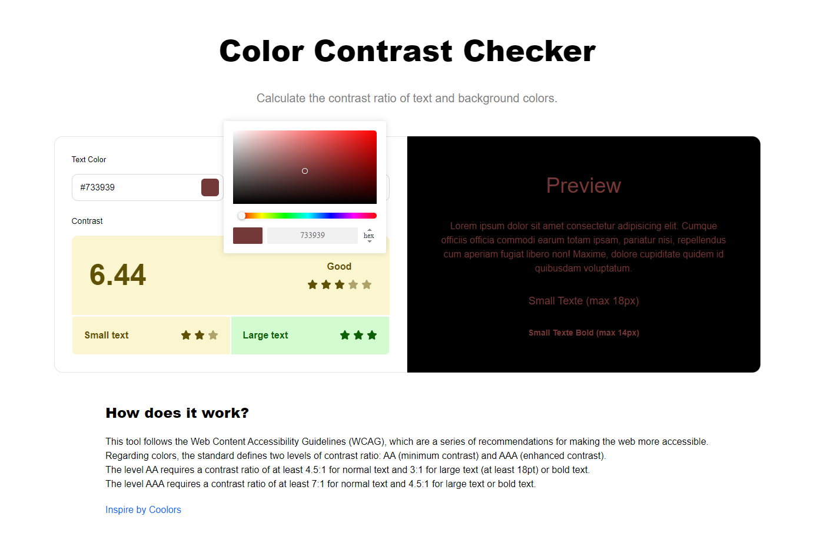

# Color Contrast Checker

Petit projet en Vue.js 3 qui permet de calculer le ratio de contraste entre deux couleurs, spécifiquement entre la couleur du texte et la couleur d'arrière-plan. Le ratio de contraste est crucial pour garantir que le contenu textuel soit facilement lisible et accessible, en particulier pour les personnes atteintes de déficiences visuelles.

Vous pouvez accéder au projet en ligne sur [https://color-contrast-picker.netlify.app](https://color-contrast-picker.netlify.app)

## Fonctionnalités

-   Calcul du Ratio de Contraste: Obtenez instantanément le ratio de contraste entre deux couleurs.
-   Sélection de Couleurs Facile: Utilisez un sélecteur de couleurs pour choisir les couleurs de texte et d'arrière-plan.

| Vu d'ensemble                                     | Vu d'ensemble avec le picker d'ouvert et un ratio moyen                   |
| ------------------------------------------------- | ------------------------------------------------------------------------- |
|  |  |
